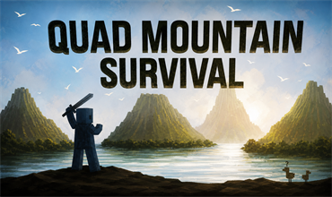
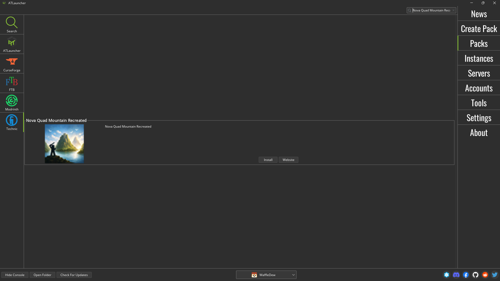
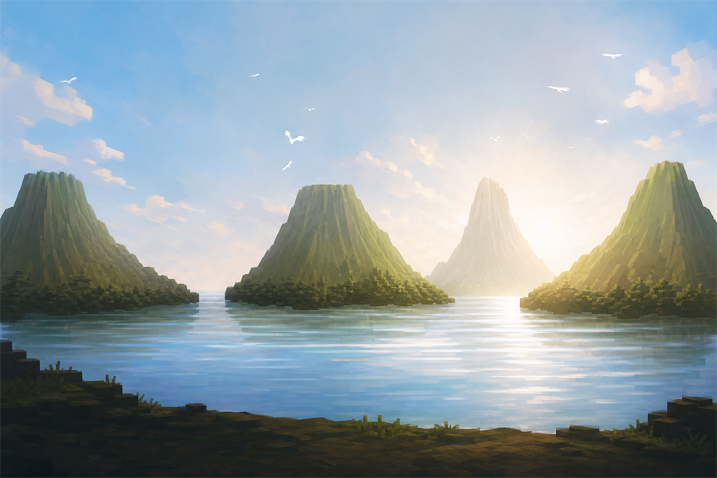

# UberHaxorNova Quad Mountain

  

  

A fan-led preservation project rebuilding the Minecraft 1.1 mod setup associated with UberHaxorNova's **Quad Mountain Survival** series.

This project is about preserving an early-2012 modded Minecraft experience: recovering period releases, identifying the original series mods, repairing incompatibilities, and documenting enough of the work that other fans can reproduce it.

> This repository is not affiliated with UberHaxorNova, Mojang, Microsoft, MultiMC, CurseForge, or the original mod authors.

## Current status

The private test instance reaches the Minecraft menu and the recovered mod set initializes successfully. Major repairs completed so far include:

- Reptile Mod backported to Minecraft 1.1, including models and sounds.
- Mo' Creatures and More Creeps and Weirdos legacy audio-path repair.
- Crab and Whales Forge texture compatibility fixes.
- A Minecraft 1.1 skin/cape compatibility fix for modern Mojang-hosted assets.
- Pam's HarvestCraft 5.2.3 ported from Minecraft 1.0 to 1.1.
- Ender Chest restored with CodeChickenCore.
- TooManyItems replaced by the period-correct Not Enough Items 1.1.2, with search and recipe viewing.

See [MODLIST.md](MODLIST.md) and [COMPATIBILITY-WORK.md](COMPATIBILITY-WORK.md) for details.

## Downloads

The latest build is available as a clearly labeled **v1.2.0 pre-release**. It includes the original Quad Island Survival world as both a ready-to-play save folder and its preserved RAR archive.

### Install through ATLauncher

1. Open ATLauncher and browse packs from the **Technic** platform.
2. Search for **Nova Quad Mountain Recreated**.
3. Select the pack and install it.

The search result should look like the screenshot below. Make sure **Technic** is selected in the left sidebar, confirm the pack name, and then choose **Install**.

  

The Technic build contains the restored Minecraft 1.1 mod setup, resources, texture packs, and Quad Island Survival world. It remains hidden while launcher installation is being tested, so direct access may be required until the listing is made public.

### Import with MultiMC

The MultiMC ZIP contains one outer instance folder, matching the layout MultiMC expects when importing an instance:

- [Download v1.2.0](https://github.com/waffledew/UberHaxorNova-Quad-Mountain/releases/tag/v1.2.0)
- Follow [MULTIMC-INSTALL.md](MULTIMC-INSTALL.md) to import it.
- Review [KNOWN-ISSUES.md](KNOWN-ISSUES.md) before playing.

This is an archival test build. Credits, original sources, licenses, and permissions for numerous recovered 2011–2012 works are still being researched. Original creators and rights holders are invited to submit corrections, attribution information, link updates, or removal-review requests through the repository's issue forms.

## Help preserve it

We welcome information from original authors, former community members, archivists, and fans. If you know a missing author, source, license, download, or the identity of the original Bat mod, please open an issue using the **Author or credit correction** form.

Read [AUTHORS-WANTED.md](AUTHORS-WANTED.md) and [CONTRIBUTING.md](CONTRIBUTING.md) before submitting material.

## Respecting original creators

Recovered does not mean public domain. We will credit original creators wherever possible, document our own compatibility work separately, honor valid removal requests, and avoid claiming ownership of third-party mods or artwork.

Repository-authored documentation is covered by [LICENSE.md](LICENSE.md). Third-party names and works retain their original ownership and licenses.

## Original inspiration

- [UberHaxorNova's Quad Mountain Survival video](https://www.youtube.com/watch?v=Sewl7P5K0Z8)
